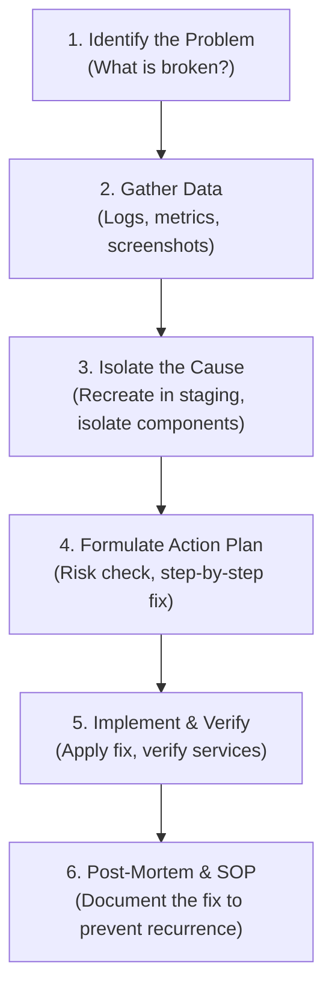

# 🛠️ Software Support & Troubleshooting Scenarios

This guide details the structural and analytical mindset required for a Software Support role. GreyOrange will assess how you handle critical production incidents under pressure and how you communicate with clients.

---

## 🧠 Structured Troubleshooting Methodology

When asked, "How do you solve a technical issue?", do not just say "I search Google." Answer using this structured engineering framework:

---

## 📋 High-Yield Scenario-Based Questions & Answers

### Scenario 1: Database performance is slow. What will you check?
* **A**: A slow database can freeze warehouse operations (e.g., robots waiting for sorting coordinates). I would investigate using these steps:
  1. **Check DB Server Resources**: Log into the database server and check CPU and memory usage (`top`, `htop`, `free -m`). High CPU suggests intensive queries; high memory/swap usage suggests database buffer issues.
  2. **Check Disk I/O**: Databases are disk-intensive. Run `iostat` or `iotop` to check if the disk read/write speeds are bottlenecking.
  3. **Check Active Connections**: Verify if connection pools are exhausted.
     * In PostgreSQL: `SELECT COUNT(*) FROM pg_stat_activity WHERE state = 'active';`
     * In MySQL: `SHOW PROCESSLIST;` (checks for locked tables and sleeping connections).
  4. **Analyze Slow Queries**: Review the database's slow query log. Identify queries taking long execution times.
     * Check if these queries are missing **Indexes** (e.g. searching table without indexed foreign keys).
     * Run `EXPLAIN ANALYZE <query>` to see the query execution plan.
  5. **Check Network Latency**: Run `ping` from the application server to the database server to rule out network latency.

---

### Scenario 2: Server is down / Application is unreachable. What steps do you take?
* **A**: When a critical production server is reported down (P1 incident), I will follow a step-by-step diagnostic chain:
  1. **Verify Connectivity (Outside-In)**:
     * Check if the domain/IP resolves: `nslookup app.greyorange.com`.
     * Test network reachability: `ping <IP_address>`.
     * If ping fails, check routing hops: `traceroute <IP_address>` to find where packets drop.
  2. **Check Port Listening**: Test if the web/application port is listening.
     * Run `curl -I http://<IP_address>:<port>` or `nc -zv <IP_address> <port>`.
  3. **Inspect Server Internals (Inside-Out)**:
     * SSH into the server: `ssh user@server-ip`. (If SSH fails, the server hardware/hypervisor is likely crashed, requiring hosting platform escalation).
     * Check process status: `ps aux | grep application_name`. If dead, attempt to start the daemon (e.g. `sudo systemctl start app`).
     * Check disk space: `df -h`. If the root partition is 100% full, the application cannot write logs/sessions and will crash.
     * Check memory usage: Run `free -m`. Check system logs (`/var/log/messages` or `dmesg | grep -i oom`) to see if the Linux Out-Of-Memory (OOM) Killer terminated the application process.
  4. **Log Analysis**: Check the latest entries in `/var/log/syslog` or the application's specific error logs using `tail -n 100` and `grep "ERROR"`.

---

### Scenario 3: A customer submits a ticket saying "Your application is not working." How do you handle it?
* **A**: This is an underspecified issue. I would handle it using this structured communication and diagnosis flow:
  1. **Acknowledge and Set Expectations**: Immediately reply to the customer. Acknowledge the ticket, express empathy, assign a ticket ID, and state that we are actively investigating.
  2. **Gather Missing Details**: Polite requests for details:
     * "What is the exact URL or page you are trying to access?"
     * "Could you share a screenshot of the error message or browser console?"
     * "Is this issue affecting all users in the warehouse, or only a specific terminal?"
  3. **Check System Status**: While waiting for the user's reply, check our internal monitoring tools (like Grafana, Datadog) to verify if there are global alarms, high API error rates, or server alerts.
  4. **Log Analysis & Reproduction**: Search logs for that user's ID or IP. Try to reproduce the steps in our staging/test environment.
  5. **Resolution & Verification**: Once identified and fixed, update the customer: explain what happened (in non-technical, user-friendly language) and ask them to verify if the issue is resolved on their end before closing the ticket.

---

## 🌟 How to Use the "STAR" Method in Interviews

When the interviewer asks: **"Tell me about a time you solved a complex technical bug."** or **"Describe a conflict you resolved with a teammate."**

* **S - Situation**: Provide context. Set the scene.
  * *Example*: "During our college hackathon, we built a web app for inventory tracking. 2 hours before the final demo, the server started throwing 500 Internal Server Errors for all users."
* **T - Task**: Describe the challenge/responsibility.
  * *Example*: "I was responsible for the backend API and server deployments, so I had to find and fix the bug immediately without losing database data."
* **A - Action**: Explain the logical steps you took.
  * *Example*: "I SSH'd into the server, checked disk space using `df -h`, and saw it was healthy. I then ran `tail -f` on the API log file and monitored HTTP requests. I noticed that when users uploaded product images, the backend tried to write files to a temporary directory that lacked write permissions. I executed `chmod 755 /uploads` and updated the Python script to catch permission exceptions."
* **R - Result**: State the positive outcome.
  * *Example*: "The server stabilized, the 500 errors disappeared, and we successfully presented our live demo, ultimately winning 2nd place in the hackathon."

---

## 🚨 Incident Priority Levels (SLA)
Software Support Engineers operate under Service Level Agreements (SLAs) based on incident severity:

| Priority | Severity | Impact | Target Resolution | Support Example |
|---|---|---|---|---|
| **P1** | Critical | Entire system/warehouse is down. Operations halted. | < 1-2 Hours | Database server crashed; robots stopped moving. |
| **P2** | Major | System runs, but core features are failing or extremely slow. | < 4 Hours | Orders are getting stuck in the queue; UI loads after 30 seconds. |
| **P3** | Minor | Minor bugs, typos, workaround exists. | < 24-48 Hours | A specific user cannot change their profile picture. |
