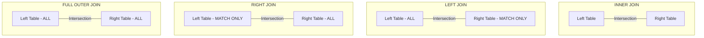

# 🗄️ SQL & Databases: Comprehensive Study Guide

As a Software Support Engineer at GreyOrange, database analysis is critical. When a customer reports an issue, you must check transaction records, find stuck states in tables, and extract reports.

---

## 📋 Confirmed 2025 Batch Interview SQL Q&As

Please tap on any question below to expand its detailed answer.

<details>
<summary><b>Q1: How do you search for text in a database column?</b></summary>
<br>
<blockquote>
<b>Answer:</b>
Use the <code>LIKE</code> operator with the wildcard character <code>%</code> in a <code>WHERE</code> clause.
<ul>
  <li><b>Search anywhere in text:</b>
    <pre><code>SELECT * FROM employees 
WHERE name LIKE '%Ravi%';</code></pre>
    This finds "Ravi", "Raviranjan", "Saurav", etc.
  </li>
  <li><b>Starts with text:</b>
    <pre><code>SELECT * FROM products 
WHERE code LIKE 'Grey%';</code></pre>
  </li>
  <li><b>Ends with text:</b>
    <pre><code>SELECT * FROM logs 
WHERE status LIKE '%failed';</code></pre>
  </li>
  <li><b>Case-insensitive search (PostgreSQL):</b> Use <code>ILIKE</code> instead of <code>LIKE</code>.</li>
</ul>
</blockquote>
</details>

<details>
<summary><b>Q2: What is the difference between an INNER JOIN and an OUTER JOIN?</b></summary>
<br>
<blockquote>
<b>Answer:</b>
<ul>
  <li><b>INNER JOIN:</b> Returns rows only when there is a match in <b>both</b> joined tables. If a row in the left table does not have a matching ID in the right table, it is excluded.</li>
  <li><b>OUTER JOIN (LEFT/RIGHT/FULL):</b> Returns matching records <b>plus</b> unmatched records from one or both tables. The missing fields are populated with <code>NULL</code>.
    <ul>
      <li><code>LEFT JOIN</code>: Returns all rows from the left table, and matched rows from the right table.</li>
      <li><code>RIGHT JOIN</code>: Returns all rows from the right table, and matched rows from the left table.</li>
      <li><code>FULL OUTER JOIN</code>: Returns all rows from both tables, filling with <code>NULL</code> where there is no match.</li>
    </ul>
  </li>
</ul>
</blockquote>
</details>

<details>
<summary><b>Q3: How do you copy or export a table to a CSV file?</b></summary>
<br>
<blockquote>
<b>Answer:</b>
Depending on the database engine, use one of the following commands:
<ul>
  <li><b>PostgreSQL (Server-side COPY):</b>
    <pre><code>COPY employees TO '/var/lib/postgresql/data/employees.csv' WITH CSV HEADER;</code></pre>
  </li>
  <li><b>PostgreSQL (psql terminal client-side \copy - no superuser required):</b>
    <pre><code>\copy employees TO 'd:/Temp/employees.csv' WITH CSV HEADER;</code></pre>
  </li>
  <li><b>MySQL (INTO OUTFILE):</b>
    <pre><code>SELECT * FROM employees
INTO OUTFILE '/var/lib/mysql-files/employees.csv'
FIELDS TERMINATED BY ','
ENCLOSED BY '"'
LINES TERMINATED BY '\n';</code></pre>
  </li>
</ul>
</blockquote>
</details>

<details>
<summary><b>Q4: What is a Primary Key vs a Foreign Key?</b></summary>
<br>
<blockquote>
<b>Answer:</b>
<ul>
  <li><b>Primary Key:</b> A column (or set of columns) that uniquely identifies each record in a table. It must contain unique values and cannot contain <code>NULL</code>. There can only be <b>one</b> primary key per table.</li>
  <li><b>Foreign Key:</b> A column (or set of columns) in one table that references the Primary Key of another table. It establishes a link between the data in the two tables, maintaining referential integrity. It can contain duplicate values and <code>NULL</code>s.</li>
</ul>
</blockquote>
</details>

---

## ⚡ The Ultimate Trick: SQL Logical Query Execution Order

When writing complex queries, you must write them in one order, but the SQL engine executes them in a completely different order. Understanding this is key to debugging syntax and grouping errors.

```
WRITTEN ORDER:          LOGICAL EXECUTION ORDER (By Engine):
1. SELECT               1. FROM & JOIN (Loads tables into memory)
2. FROM                 2. WHERE (Filters individual base rows)
3. JOIN                 3. GROUP BY (Aggregates rows into groups)
4. WHERE                4. HAVING (Filters grouped rows)
5. GROUP BY             5. SELECT (Retrieves columns / calculates expressions)
6. HAVING               6. DISTINCT (Deduplicates results)
7. ORDER BY             7. ORDER BY (Sorts output rows)
8. LIMIT                8. LIMIT / OFFSET (Restricts output count)
```

* **Why this matters**: You cannot use a column alias created in the `SELECT` clause inside the `WHERE` clause because `WHERE` runs *before* `SELECT`. However, you *can* use it in the `ORDER BY` clause because `ORDER BY` runs *after* `SELECT`.

---

## 🏗️ Venn Diagram Representation of SQL Joins



---

## 📊 Database Indexing Deep Dive

An **Index** is a data structure (typically a B-Tree) that speeds up the retrieval of rows from a table at the cost of additional storage and slower writes.

| Metric | Clustered Index | Non-Clustered Index |
|---|---|---|
| **Physical Storage** | Dictates the physical order of data rows in the table. | Creates a separate index tree. The leaf nodes contain pointers to the data rows. |
| **Quantity** | **Only 1** allowed per table. | **Multiple** allowed per table. |
| **Creation** | Automatically created when a Primary Key is defined. | Manually created using `CREATE INDEX`. |
| **Speed** | Faster retrieval because it leads directly to the data. | Slower than Clustered because it requires an extra lookup step (Index $\rightarrow$ Row). |
| **Write Impact** | High write cost if index columns change, reorganizing physical data. | Lower write cost (only updates the index tree). |

---

## 🔄 Aggregate Functions vs Window Functions

* **Aggregate Functions (`SUM`, `AVG`, `COUNT`)**: Group multiple rows of data into a single summary row. It collapses individual rows.
* **Window Functions (`ROW_NUMBER`, `DENSE_RANK`, `LEAD`, `LAG`)**: Perform calculations across a set of table rows related to the current row, but **do not collapse the rows**. Every row retains its unique identity.

### Example: Finding Employee Rank by Salary
```sql
SELECT name, department, salary,
       RANK() OVER (PARTITION BY department ORDER BY salary DESC) AS salary_rank
FROM employees;
```
* `PARTITION BY department` divides the rows into groups (windows) by department.
* `ORDER BY salary DESC` sorts the employees in each department window.
* `RANK()` assigns a rank to each employee within their department window.

---

## 📝 15+ Advanced Practice SQL Queries with Explanations

Use the following tables for all queries:

**`employees` Table**
| id | name | manager_id | dept_id | salary | hire_date |
|---|---|---|---|---|---|
| 1 | Ravi | 3 | 10 | 80000 | 2025-01-15 |
| 2 | Priya | 3 | 20 | 75000 | 2025-02-10 |
| 3 | Amit | NULL | 10 | 120000 | 2024-05-01 |
| 4 | Rahul | 1 | 10 | 85000 | 2025-05-20 |
| 5 | Sneha | 2 | NULL | 60000 | 2026-06-01 |

**`departments` Table**
| id | department_name |
|---|---|
| 10 | Engineering |
| 20 | Support |
| 30 | HR |

---

### Query 1: Find the 2nd Highest Salary
* **Objective**: Retrieve the second highest salary value from the employee table.
* **Query**:
  ```sql
  SELECT MAX(salary) AS second_highest
  FROM employees
  WHERE salary < (SELECT MAX(salary) FROM employees);
  ```
* **Explanation**: The subquery finds the maximum salary (120,000). The outer query finds the maximum salary that is strictly less than 120,000, which is 85,000.
* **Expected Output**:
  | second_highest |
  |---|
  | 85000 |

---

### Query 2: Find the 2nd Highest Salary (Using LIMIT & OFFSET)
* **Objective**: Find the second highest salary using sorting and offsets.
* **Query**:
  ```sql
  SELECT DISTINCT salary
  FROM employees
  ORDER BY salary DESC
  LIMIT 1 OFFSET 1;
  ```
* **Explanation**: `ORDER BY salary DESC` sorts salaries from highest to lowest. `LIMIT 1` retrieves one row. `OFFSET 1` skips the first row (the highest).
* **Expected Output**:
  | salary |
  |---|
  | 85000 |

---

### Query 3: Find Employees Earning More Than Their Managers
* **Objective**: Identify employees who have a higher salary than their direct manager.
* **Query**:
  ```sql
  SELECT e.name AS employee_name, e.salary AS emp_salary,
         m.name AS manager_name, m.salary AS mgr_salary
  FROM employees e
  INNER JOIN employees m ON e.manager_id = m.id
  WHERE e.salary > m.salary;
  ```
* **Explanation**: We run a Self-Join by joining the employee table `e` to itself as `m` using the manager ID. The `WHERE` clause filters rows where the employee's salary exceeds the manager's salary.
* **Expected Output**:
  | employee_name | emp_salary | manager_name | mgr_salary |
  |---|---|---|---|
  | Rahul | 85000 | Ravi | 80000 |

---

### Query 4: Find Duplicate Emails (or Names)
* **Objective**: Retrieve names that appear more than once in the table.
* **Query**:
  ```sql
  SELECT name, COUNT(name) AS occurrences
  FROM employees
  GROUP BY name
  HAVING COUNT(name) > 1;
  ```
* **Explanation**: Group rows by the name column. `COUNT(name)` calculates occurrences. `HAVING` filters out names that appear only once.

---

### Query 5: Delete Duplicates keeping the Lowest ID
* **Objective**: Remove duplicate records from a table, retaining only the record with the minimum ID.
* **Query**:
  ```sql
  DELETE FROM employees
  WHERE id NOT IN (
      SELECT MIN(id)
      FROM employees
      GROUP BY name
  );
  ```
* **Explanation**: The subquery groups employees by name and finds the minimum ID for each name. The outer query deletes all records whose ID is not part of this list.

---

### Query 6: Find Departments with No Employees
* **Objective**: Retrieve departments that have no employees assigned to them.
* **Query**:
  ```sql
  SELECT d.department_name
  FROM departments d
  LEFT JOIN employees e ON d.id = e.dept_id
  WHERE e.id IS NULL;
  ```
* **Explanation**: We run a `LEFT JOIN` starting with the departments table. This ensures all departments are listed. If a department has no matching employees, the employee fields (`e.id`) become `NULL`. The `WHERE e.id IS NULL` filters for these departments.
* **Expected Output**:
  | department_name |
  |---|
  | HR |

---

### Query 7: Swap Salary Values in a Single Update
* **Objective**: Write an update query that swaps salaries of employees (e.g. swap salary of Ravi and Priya) without using a temp table.
* **Query**:
  ```sql
  UPDATE employees
  SET salary = CASE 
      WHEN name = 'Ravi' THEN 75000
      WHEN name = 'Priya' THEN 80000
      ELSE salary
  END
  WHERE name IN ('Ravi', 'Priya');
  ```
* **Explanation**: The `CASE` statement dynamically decides the new salary based on the employee's name. The `WHERE` clause restricts updates to only the target rows, preserving performance.

---

### Query 8: Find Employees Hired in the Last 365 Days
* **Objective**: Retrieve employees hired in the last year.
* **Query (PostgreSQL)**:
  ```sql
  SELECT name, hire_date
  FROM employees
  WHERE hire_date >= CURRENT_DATE - INTERVAL '1 year';
  ```
* **Query (MySQL)**:
  ```sql
  SELECT name, hire_date
  FROM employees
  WHERE hire_date >= DATE_SUB(CURDATE(), INTERVAL 1 YEAR);
  ```

---

### Query 9: Count Active vs Inactive Employees (Conditional Aggregation)
* **Objective**: Retrieve counts of employees grouped by their status in a single row.
* **Query**:
  ```sql
  SELECT 
      SUM(CASE WHEN salary >= 80000 THEN 1 ELSE 0 END) AS high_earners,
      SUM(CASE WHEN salary < 80000 THEN 1 ELSE 0 END) AS low_earners
  FROM employees;
  ```
* **Expected Output**:
  | high_earners | low_earners |
  |---|---|
  | 3 | 2 |

---

### Query 10: Find Employees with No Department Assigned
* **Objective**: Retrieve employees who do not belong to any department.
* **Query**:
  ```sql
  SELECT name FROM employees WHERE dept_id IS NULL;
  ```
* **Expected Output**:
  | name |
  |---|
  | Sneha |

---

### Query 11: Find the Department with the Highest Total Salary
* **Objective**: Retrieve the department name that has the highest cumulative salary expenditure.
* **Query**:
  ```sql
  SELECT d.department_name, SUM(e.salary) AS total_payroll
  FROM departments d
  INNER JOIN employees e ON d.id = e.dept_id
  GROUP BY d.department_name
  ORDER BY total_payroll DESC
  LIMIT 1;
  ```
* **Expected Output**:
  | department_name | total_payroll |
  |---|---|
  | Engineering | 285000 |

---

### Query 12: List Department Name and its Average Salary, showing only those above 80,000
* **Objective**: Aggregate salaries by department and filter groups.
* **Query**:
  ```sql
  SELECT d.department_name, AVG(e.salary) AS avg_salary
  FROM departments d
  INNER JOIN employees e ON d.id = e.dept_id
  GROUP BY d.department_name
  HAVING AVG(e.salary) > 80000;
  ```
* **Expected Output**:
  | department_name | avg_salary |
  |---|---|
  | Engineering | 95000.00 |

---

### Query 13: Find Employees with the Same Salary
* **Objective**: Find employees who share identical salary values.
* **Query**:
  ```sql
  SELECT e1.name, e1.salary
  FROM employees e1
  INNER JOIN employees e2 ON e1.salary = e2.salary AND e1.id <> e2.id;
  ```
* **Explanation**: Self-join employees based on salary. The condition `e1.id <> e2.id` prevents matching an employee to themselves.

---

### Query 14: Extract the Domain Name from Email Column
* **Objective**: Split email strings to retrieve domain names.
* **Query (PostgreSQL)**:
  ```sql
  -- Assuming emails exist in a column named email
  SELECT name, SUBSTRING(email FROM '@(.*)$') AS domain
  FROM employees;
  ```
* **Query (MySQL)**:
  ```sql
  SELECT name, SUBSTRING_INDEX(email, '@', -1) AS domain
  FROM employees;
  ```

---

### Query 15: Find the N-th Highest Salary (Using Subquery)
* **Objective**: General subquery method to find Nth highest salary without using LIMIT.
* **Query**:
  ```sql
  SELECT e1.salary
  FROM employees e1
  WHERE N-1 = (
      SELECT COUNT(DISTINCT e2.salary)
      FROM employees e2
      WHERE e2.salary > e1.salary
  );
  ```
* **Explanation**: For the Nth highest salary, there must exist exactly N-1 distinct salaries higher than it. If N=2, it finds the salary where exactly 1 salary is higher.
