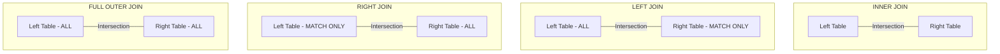

# 🗄️ SQL & Databases — COMPLETE Study Guide
### GreyOrange Software Support Engineer Intern | Drive: June 23-24, 2026

> **Weight in Interview**: 35% | **Priority**: HIGH  
> Understanding database logic is critical for diagnosing order state freezes, warehouse stock inconsistencies, and system latency.

---

## PART 1: SQL Logical Query Execution Order

When writing SQL queries, you write them in one order, but the database engine processes them in a completely different sequence. Understanding this is key to debugging syntax and grouping errors.

```
WRITTEN ORDER:          LOGICAL ENGINE EXECUTION ORDER:
1. SELECT               1. FROM & JOIN (Loads tables into memory)
2. FROM                 2. WHERE       (Filters base rows before grouping)
3. JOIN                 3. GROUP BY    (Groups rows for aggregation)
4. WHERE                4. HAVING      (Filters aggregated groups)
5. GROUP BY             5. SELECT      (Evaluates columns / expressions / functions)
6. HAVING               6. DISTINCT    (Deduplicates output)
7. ORDER BY             7. ORDER BY    (Sorts output rows)
8. LIMIT                8. LIMIT       (Restricts total row count)
```

* **Key Insight**: You **cannot** use a column alias defined in the `SELECT` clause within a `WHERE` clause because `WHERE` runs *before* the `SELECT` clause defines the alias. However, you **can** use the alias in the `ORDER BY` clause because it runs *after* `SELECT`.

---

## PART 2: Primary Key vs Foreign Key

* **Primary Key (PK)**:
  * Uniquely identifies each record in a table.
  * Must contain unique, non-null values.
  * Only **one** primary key is allowed per table.
  * Automatically creates a clustered index.
* **Foreign Key (FK)**:
  * A column (or group of columns) that references the Primary Key of another table.
  * Establishes a parent-child relationship between tables, enforcing referential integrity.
  * Can contain duplicate values and `NULL` values.
  * Multiple foreign keys are allowed per table.

---

## PART 3: SQL JOIN Types

Use the Venn diagrams below to visualize table intersections:



* **INNER JOIN**: Returns rows only when there is a matching value in both tables. Unmatched rows are excluded.
* **LEFT JOIN (LEFT OUTER JOIN)**: Returns all rows from the left table and matched rows from the right. If no match exists, columns from the right table return as `NULL`.
* **RIGHT JOIN (RIGHT OUTER JOIN)**: Returns all rows from the right table and matched rows from the left. Unmatched left columns return as `NULL`.
* **FULL OUTER JOIN**: Returns all rows from both tables, filling unmatched fields with `NULL`.

---

## PART 4: Database Indexing

An index is a B-Tree structure that speeds up query retrieval at the expense of write performance and storage.

| Metric | Clustered Index | Non-Clustered Index |
|---|---|---|
| **Physical Storage** | Dictates the physical sorting order of data rows on disk. | Separate structure from data. Leaves contain index keys and pointers to rows. |
| **Quantity Limit** | **Only 1** per table. | **Multiple** allowed per table. |
| **Default Creation**| Automatically created on the Primary Key column. | Created manually with `CREATE INDEX idx_name ON...` |
| **Read Speed** | Extremely fast (directly points to physical row location).| Slightly slower (requires secondary lookup from index to row). |
| **Write Cost** | High (physical data must be re-sorted on disk). | Low (only the index tree is updated). |

---

## PART 5: Window Functions (`RANK()` vs `DENSE_RANK()`)

Unlike aggregate functions that collapse multiple rows into a single summary row, window functions perform calculations across partitions but **do not collapse the rows**. Every row retains its unique identity.

* `ROW_NUMBER()`: Assigns a unique sequential integer to rows, starting at 1. Duplicate values receive different numbers arbitrarily.
* `RANK()`: Assigns ranks to rows. Duplicate values receive the same rank, but the next rank is skipped (e.g. 1, 2, 2, 4).
* `DENSE_RANK()`: Assigns ranks without skipping numbers (e.g. 1, 2, 2, 3).

---

## PART 6: 20 Must-Know SQL Queries

We will use the following schema and data for all queries:

### **`employees` Table**
| id | name | manager_id | dept_id | salary | hire_date |
|---|---|---|---|---|---|
| 1 | Ravi | 3 | 10 | 80000 | 2025-01-15 |
| 2 | Priya | 3 | 20 | 75000 | 2025-02-10 |
| 3 | Amit | NULL | 10 | 120000 | 2024-05-01 |
| 4 | Rahul | 1 | 10 | 85000 | 2025-05-20 |
| 5 | Sneha | 2 | NULL | 60000 | 2026-06-01 |

### **`departments` Table**
| id | department_name |
|---|---|
| 10 | Engineering |
| 20 | Support |
| 30 | HR |

---

### Query 1: Find the 2nd Highest Salary (Subquery Method)
* **Objective**: Find the second highest salary value.
* **Query**:
  ```sql
  SELECT MAX(salary) AS second_highest
  FROM employees
  WHERE salary < (SELECT MAX(salary) FROM employees);
  ```
* **Explanation**: The subquery returns `120000` (max salary). The outer query returns the maximum salary that is strictly less than `120000`, which is `85000`.
* **Output**:
  | second_highest |
  |---|
  | 85000 |

---

### Query 2: Find the 2nd Highest Salary (LIMIT/OFFSET Method)
* **Objective**: Find the second highest salary using sorting.
* **Query**:
  ```sql
  SELECT DISTINCT salary
  FROM employees
  ORDER BY salary DESC
  LIMIT 1 OFFSET 1;
  ```
* **Explanation**: Sorts unique salaries descending, skips the first row (highest), and limits the output to 1 row.

---

### Query 3: Employees Earning More Than Their Manager
* **Objective**: Identify employees earning more than their direct manager.
* **Query**:
  ```sql
  SELECT e.name AS employee, e.salary AS emp_salary,
         m.name AS manager, m.salary AS mgr_salary
  FROM employees e
  INNER JOIN employees m ON e.manager_id = m.id
  WHERE e.salary > m.salary;
  ```
* **Explanation**: Self-join on `manager_id = id` and filter where employee salary > manager salary.
* **Output**:
  | employee | emp_salary | manager | mgr_salary |
  |---|---|---|---|
  | Rahul | 85000 | Ravi | 80000 |

---

### Query 4: Find Duplicate Names
* **Objective**: Retrieve names that appear more than once in the table.
* **Query**:
  ```sql
  SELECT name, COUNT(name) AS occurrences
  FROM employees
  GROUP BY name
  HAVING COUNT(name) > 1;
  ```
* **Explanation**: Group by name, count occurrences, and filter for counts greater than 1 using `HAVING`.

---

### Query 5: Delete Duplicates keeping the Lowest ID
* **Objective**: Remove duplicate records from a table, retaining only the record with the minimum ID.
* **Query**:
  ```sql
  DELETE FROM employees
  WHERE id NOT IN (
      SELECT MIN(id)
      FROM employees
      GROUP BY name
  );
  ```

---

### Query 6: Find Departments with No Employees
* **Objective**: Identify departments with zero active assignments.
* **Query**:
  ```sql
  SELECT d.department_name
  FROM departments d
  LEFT JOIN employees e ON d.id = e.dept_id
  WHERE e.id IS NULL;
  ```
* **Explanation**: Left join from departments to employees. Any department without employees will have a `NULL` employee ID.
* **Output**:
  | department_name |
  |---|
  | HR |

---

### Query 7: Swap Salary Values in a Single Update
* **Objective**: Swap the salaries of 'Ravi' and 'Priya' without temporary storage.
* **Query**:
  ```sql
  UPDATE employees
  SET salary = CASE 
      WHEN name = 'Ravi' THEN 75000
      WHEN name = 'Priya' THEN 80000
      ELSE salary
  END
  WHERE name IN ('Ravi', 'Priya');
  ```

---

### Query 8: Find Employees Hired in the Last Year (PostgreSQL)
* **Objective**: Retrieve employees hired in the last 365 days.
* **Query**:
  ```sql
  SELECT name, hire_date
  FROM employees
  WHERE hire_date >= CURRENT_DATE - INTERVAL '1 year';
  ```
* **MySQL equivalent**:
  ```sql
  SELECT name, hire_date FROM employees WHERE hire_date >= DATE_SUB(CURDATE(), INTERVAL 1 YEAR);
  ```

---

### Query 9: Count Active High vs Low Earners (Conditional Aggregation)
* **Objective**: Categorize salaries into high (>=80k) vs low (<80k) earners.
* **Query**:
  ```sql
  SELECT 
      SUM(CASE WHEN salary >= 80000 THEN 1 ELSE 0 END) AS high_earners,
      SUM(CASE WHEN salary < 80000 THEN 1 ELSE 0 END) AS low_earners
  FROM employees;
  ```
* **Output**:
  | high_earners | low_earners |
  |---|---|
  | 3 | 2 |

---

### Query 10: Find Employees with No Department Assigned
* **Objective**: Identify employees with unassigned department IDs.
* **Query**:
  ```sql
  SELECT name FROM employees WHERE dept_id IS NULL;
  ```
* **Output**:
  | name |
  |---|
  | Sneha |

---

### Query 11: Find the Department with the Highest Total Salary
* **Objective**: Retrieve the department name with the highest payroll.
* **Query**:
  ```sql
  SELECT d.department_name, SUM(e.salary) AS total_payroll
  FROM departments d
  INNER JOIN employees e ON d.id = e.dept_id
  GROUP BY d.department_name
  ORDER BY total_payroll DESC
  LIMIT 1;
  ```
* **Output**:
  | department_name | total_payroll |
  |---|---|
  | Engineering | 285000 |

---

### Query 12: List Department and Average Salary above 80,000
* **Objective**: Aggregate average salary per department, showing only averages > 80,000.
* **Query**:
  ```sql
  SELECT d.department_name, AVG(e.salary) AS avg_salary
  FROM departments d
  INNER JOIN employees e ON d.id = e.dept_id
  GROUP BY d.department_name
  HAVING AVG(e.salary) > 80000;
  ```
* **Output**:
  | department_name | avg_salary |
  |---|---|
  | Engineering | 95000.00 |

---

### Query 13: Find Employees with the Same Salary
* **Objective**: Find different employees who share identical salary values.
* **Query**:
  ```sql
  SELECT e1.name, e1.salary
  FROM employees e1
  INNER JOIN employees e2 ON e1.salary = e2.salary AND e1.id <> e2.id;
  ```

---

### Query 14: Extract Domain from Email Column (PostgreSQL)
* **Objective**: Parse domain names out of email strings (e.g. `ravi@gmail.com` -> `gmail.com`).
* **Query**:
  ```sql
  SELECT SUBSTRING(email FROM '@(.*)$') AS domain FROM employees;
  ```
* **MySQL equivalent**:
  ```sql
  SELECT SUBSTRING_INDEX(email, '@', -1) AS domain FROM employees;
  ```

---

### Query 15: Find the N-th Highest Salary (Generic Subquery)
* **Objective**: Retrieve the N-th highest salary dynamically without LIMIT (essential for generic database engines).
* **Query**:
  ```sql
  SELECT e1.salary
  FROM employees e1
  WHERE N-1 = (
      SELECT COUNT(DISTINCT e2.salary)
      FROM employees e2
      WHERE e2.salary > e1.salary
  );
  ```
* **Explanation**: For the Nth highest salary, there are exactly N-1 higher distinct salaries.

---

### Query 16: List Employee Hierarchies (Recursive CTE)
* **Objective**: Display employees and their management paths recursively.
* **Query (PostgreSQL/MySQL 8+)**:
  ```sql
  WITH RECURSIVE org_chart AS (
      -- Base case: Top level managers (no manager_id)
      SELECT id, name, manager_id, 1 as level, CAST(name AS CHAR(200)) as path
      FROM employees
      WHERE manager_id IS NULL
      
      UNION ALL
      
      -- Recursive case: Child nodes
      SELECT e.id, e.name, e.manager_id, o.level + 1, CAST(CONCAT(o.path, ' -> ', e.name) AS CHAR(200))
      FROM employees e
      INNER JOIN org_chart o ON e.manager_id = o.id
  )
  SELECT id, name, level, path FROM org_chart ORDER BY level, id;
  ```
* **Output**:
  | id | name | level | path |
  |---|---|---|---|
  | 3 | Amit | 1 | Amit |
  | 1 | Ravi | 2 | Amit -> Ravi |
  | 2 | Priya | 2 | Amit -> Priya |
  | 4 | Rahul | 3 | Amit -> Ravi -> Rahul |
  | 5 | Sneha | 3 | Amit -> Priya -> Sneha |

---

### Query 17: Show Salary details relative to Department Average
* **Objective**: Show employee details and the average department salary side-by-side without collapsing rows.
* **Query**:
  ```sql
  SELECT name, salary, dept_id,
         AVG(salary) OVER(PARTITION BY dept_id) AS dept_avg_salary
  FROM employees;
  ```
* **Output**:
  | name | salary | dept_id | dept_avg_salary |
  |---|---|---|---|
  | Ravi | 80000 | 10 | 95000.00 |
  | Amit | 120000 | 10 | 95000.00 |
  | Rahul | 85000 | 10 | 95000.00 |
  | Priya | 75000 | 20 | 75000.00 |
  | Sneha | 60000 | NULL | 60000.00 |

---

### Query 18: Find Departments with More Than 2 Employees
* **Objective**: Retrieve department names containing a large count of staff.
* **Query**:
  ```sql
  SELECT d.department_name, COUNT(e.id) AS employee_count
  FROM departments d
  INNER JOIN employees e ON d.id = e.dept_id
  GROUP BY d.department_name
  HAVING COUNT(e.id) > 2;
  ```
* **Output**:
  | department_name | employee_count |
  |---|---|
  | Engineering | 3 |

---

### Query 19: Get the First and Last Hired Employees in Each Department
* **Objective**: Get the earliest and latest hire dates per department along with employee names.
* **Query**:
  ```sql
  WITH ranked_hires AS (
      SELECT name, dept_id, hire_date,
             ROW_NUMBER() OVER (PARTITION BY dept_id ORDER BY hire_date ASC) as earliest,
             ROW_NUMBER() OVER (PARTITION BY dept_id ORDER BY hire_date DESC) as latest
      FROM employees
      WHERE dept_id IS NOT NULL
  )
  SELECT r1.dept_id, r1.name AS earliest_employee, r1.hire_date AS earliest_date,
         r2.name AS latest_employee, r2.hire_date AS latest_date
  FROM ranked_hires r1
  INNER JOIN ranked_hires r2 ON r1.dept_id = r2.dept_id AND r1.earliest = 1 AND r2.latest = 1;
  ```
* **Output**:
  | dept_id | earliest_employee | earliest_date | latest_employee | latest_date |
  |---|---|---|---|---|
  | 10 | Amit | 2024-05-01 | Rahul | 2025-05-20 |
  | 20 | Priya | 2025-02-10 | Priya | 2025-02-10 |

---

### Query 20: Retrieve Cumulative Salary Spend (Running Total)
* **Objective**: Retrieve cumulative payroll spend for Engineering (`dept_id = 10`) ordered by hire dates.
* **Query**:
  ```sql
  SELECT name, salary, hire_date,
         SUM(salary) OVER (ORDER BY hire_date ASC) AS running_total
  FROM employees
  WHERE dept_id = 10;
  ```
* **Output**:
  | name | salary | hire_date | running_total |
  |---|---|---|---|
  | Amit | 120000 | 2024-05-01 | 120000 |
  | Ravi | 80000 | 2025-01-15 | 200000 |
  | Rahul | 85000 | 2025-05-20 | 285000 |

---

## PART 7: Database Export to CSV

* **PostgreSQL (Server-side Copy)**:
  ```sql
  COPY employees TO '/var/lib/postgresql/data/employees.csv' WITH CSV HEADER;
  ```
* **PostgreSQL (psql client copy — no superuser privilege needed)**:
  ```sql
  \copy employees TO 'D:/Temp/employees.csv' WITH CSV HEADER;
  ```
* **MySQL (Into Outfile)**:
  ```sql
  SELECT * FROM employees
  INTO OUTFILE '/var/lib/mysql-files/employees.csv'
  FIELDS TERMINATED BY ','
  ENCLOSED BY '"'
  LINES TERMINATED BY '\n';
  ```
